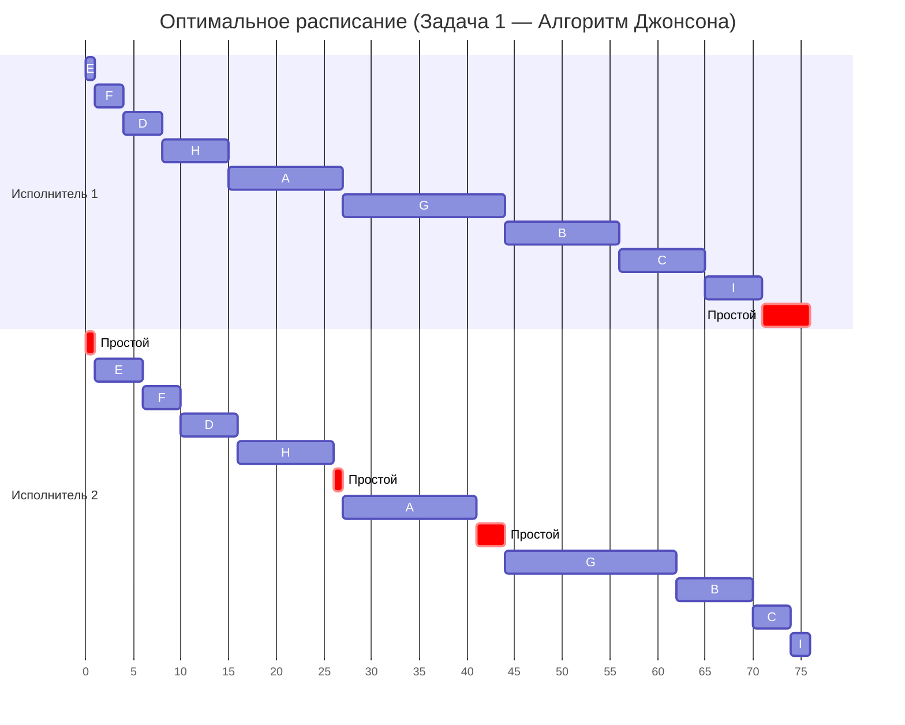

```mermaid
gantt
    title Оптимальное расписание (Задача 1 — Алгоритм Джонсона)
    dateFormat X
    axisFormat %s

    section Исполнитель 1
    E        :e1, 0, 1s
    F        :f1, after e1, 3s
    D        :d1, after f1, 4s
    H        :h1, after d1, 7s
    A        :a1, after h1, 12s
    G        :g1, after a1, 17s
    B        :b1, after g1, 12s
    C        :c1, after b1, 9s
    I        :i1, after c1, 6s
    Простой  :crit, p1, after i1, 5s

    section Исполнитель 2
    Простой  :crit, p2_1, 0, 1s
    E        :e2, after p2_1, 5s
    F        :f2, after e2, 4s
    D        :d2, after f2, 6s
    H        :h2, after d2, 10s
    Простой  :crit, p2_2, after h2, 1s
    A        :a2, after p2_2, 14s
    Простой  :crit, p2_3, after a2, 3s
    G        :g2, after p2_3, 18s
    B        :b2, after g2, 8s
    C        :c2, after b2, 4s
    I        :i2, after c2, 2s
```
