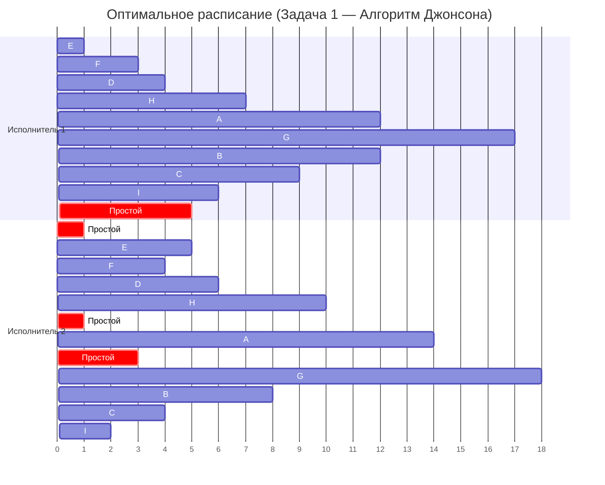

```mermaid
gantt
    title Оптимальное расписание (Задача 1 — Алгоритм Джонсона)
    dateFormat X
    axisFormat %s

    section Исполнитель 1
    E        :e1, 0, 1
    F        :f1, 1, 3
    D        :d1, 4, 4
    H        :h1, 8, 7
    A        :a1, 15, 12
    G        :g1, 27, 17
    B        :b1, 44, 12
    C        :c1, 56, 9
    I        :i1, 65, 6
    Простой  :crit, p1, 71, 5

    section Исполнитель 2
    Простой  :crit, p2_1, 0, 1
    E        :e2, 1, 5
    F        :f2, 6, 4
    D        :d2, 10, 6
    H        :h2, 16, 10
    Простой  :crit, p2_2, 26, 1
    A        :a2, 27, 14
    Простой  :crit, p2_3, 41, 3
    G        :g2, 44, 18
    B        :b2, 62, 8
    C        :c2, 70, 4
    I        :i2, 74, 2
```
